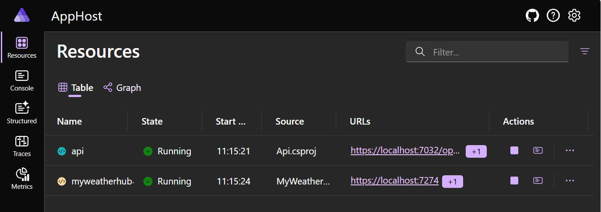

# 使用 .NET Aspire App Host 的仪表板和编排

.NET Aspire 提供了用于对分布式应用程序中的资源和依赖项进行建模的 API。除了这些 API 之外，还有一些工具可以支持一些重要的场景。Orchestrator 用于本地开发目的。

在继续之前，请考虑 .NET Aspire 中使用的一些常用术语：

- *App model*: 构建您的分布式应用的资源的集合 ([DistributedApplication](https://learn.microsoft.com/dotnet/api/aspire.hosting.distributedapplication)). 有关更正式的定义，请参阅 [Define the app model](https://learn.microsoft.com/dotnet/aspire/fundamentals/app-host-overview?tabs=docker#define-the-app-model).
- *App host/编排项目*: 该 .NET 项目用来定义和编排 *app model*, 使用 **.AppHost* 后缀 (约定).
- *Resource*: [资源](https://learn.microsoft.com/dotnet/aspire/fundamentals/app-host-overview?tabs=docker#built-in-resource-types) 表示应用程序的一部分，无论是 .NET 项目、容器、可执行文件，还是其他资源，如数据库、缓存或云服务（如存储服务）。
- *Reference*: Reference 定义资源之间的关联, 使用 `WithReference` API 以依赖的方式表现出来. 更多信息, 请参阅 [Reference resources](https://learn.microsoft.com/dotnet/aspire/fundamentals/app-host-overview?tabs=docker#reference-resources).

## 创建 App Host 项目

### Visual Studio & Visual Studio Code

1. 在解决方案中添加名为 `AppHost` 的新项目:
   - 在解决方案上右键，在弹出菜单上选择 `Add` > `New Project`.
   - 选择 `.NET Aspire App Host` 项目模板.
   - 将项目命名为 `AppHost`.
   - 点击 `Next` > `Create`.

    *Visual Studio*
    

    *Visual Studio Code*
    

### 命令行

1. 使用 `dotnet new aspire-apphost` 命令创建新项目:

    ```bash
    dotnet new aspire-apphost -n AppHost
    ```

## 添加项目引用

1. 在新建的 `AppHost` 项目中添加对 `Api` 和 `MyWeatherHub` 项目的引用:
   - 在 `AppHost` 项目上右键，选择 `Add` > `Reference`.
   - 选择 `Api` 和 `MyWeatherHub` 项目，然后点击 `OK`.

     > 高级提示: 在 Visual Studio 2022 中, 您可以通过拖拽项目到其它项目来添加引用.

2. 在添加这些引用之后，助手类将会自动生成，以帮助在 App Host 中将它们添加到 app model。

## 编排应用

1. 在 `AppHost` 项目中，更新 `Program.cs` 文件, 在紧接  `var builder = DistributedApplication.CreateBuilder(args);` 行之后，添加如下代码：

    ```csharp
    var api = builder.AddProject<Projects.Api>("api");

    var web = builder.AddProject<Projects.MyWeatherHub>("myweatherhub");
    ```

## 运行应用

1. 在 Visual Stdio 中，在 `AppHost` 项目上右键，通过点击 `Set Default Project`，将 `AppHost` 项目设置为启动项目.
2. 如果你在使用 Visual Studio Code，打开 `launch.json`，使用如下内容替换其中的内容:

    ```json
    {
        "version": "0.2.0",
        "configurations": [
            {
                "name": "Run AppHost",
                "type": "dotnet",
                "request": "launch",
                "projectPath": "${workspaceFolder}\\AppHost\\AppHost.csproj"
            }
        ]
    }
    ```

3. 通过 Visual Studio Code 或 Visual Studio 的 `Run and Debug` 面板来运训 App Host .
4. 此时， .NET Aspire 的仪表板将会在你的默认浏览器中打开，其中显示你的应用中的资源和依赖。

    

5. 通过点击 `MyWeatherHub` 项目的端点来打开气象页面，它的地址应该是 [https://localhost:7274](https://localhost:7274).
6. 请注意，`Api` 和 `MyWeatherHub` 两个项目都处于运行状态，并且像使用配置设置之前一样相互通信。
7. 返回到 Aspire 仪表板, 点击 `View Logs` 按钮查看来自 `Api` 和 `MyWeatherHub` 项目的控制台日志。
8. 选择 `Traces` 页签，然后选择某个 API 调用生成的 trace 上的 `View` 。

    

9. 探索 `Metrics` 页签来查看来自 `Api` 和 `MyWeatherHub` 项目的指标。

    

## 创建一个错误

1. 打开仪表板上的 `Structured` 页签。
2. 将日志级别 `Level` 调整到 `Error` ，注意并没有 error 出现。
3. 在 `MyWeatherApp` 站点上，在多个不同的城市上点击来生成错误。通常，点击 5 个不同的城市将会生成至少一个错误。
4. 在生成错误之后， `Structured` 页签将会自动更新并显示出错误信息。

    

5. 点击 `Trace` 或者 `Details` 链接来查看错误信息和调用堆栈。

**下一节**: [模块 #4: Service Discovery](../Lesson-04-ServiceDiscovery/README.md)
