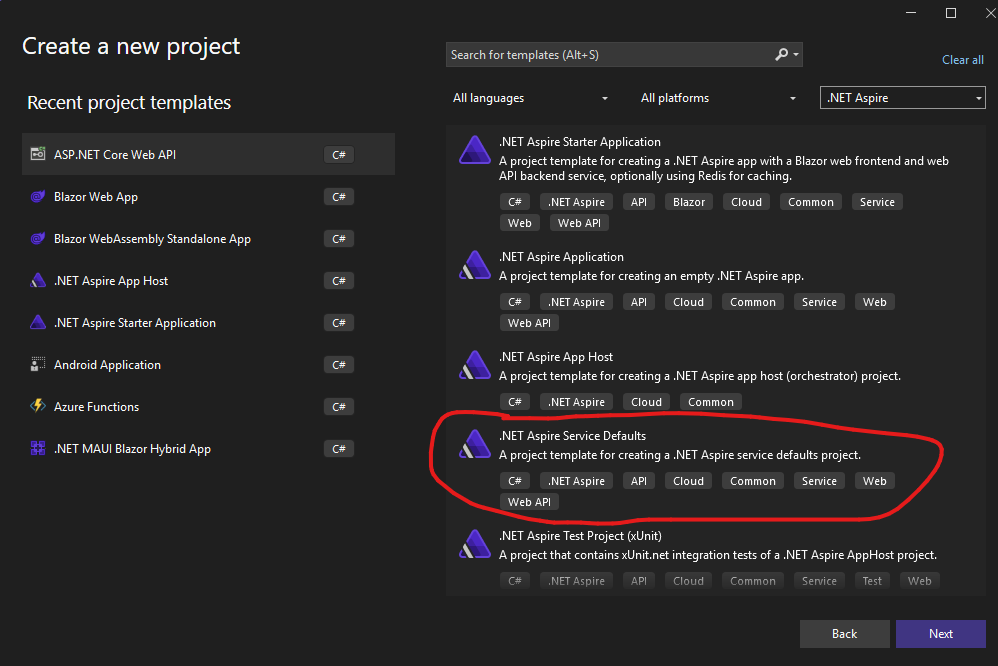

> 이 문서는 [Azure OpenAI](https://learn.microsoft.com/azure/ai-services/openai/overview)를 이용해 초벌 번역 후 검수를 진행했습니다. 따라서 번역 품질이 기대와 다를 수 있습니다. 문서 번역에 대해 제안할 내용이 있을 경우, [이슈](../../../issue)에 남겨주시면 확인후 반영하겠습니다.

# 서비스 기본값 (스마트 기본값)

## 소개

.NET Aspire는 .NET 애플리케이션에서 일반적으로 사용하는 서비스에 대한 일련의 스마트 기본값을 제공합니다. 이러한 기본값을 통해 보다 신속한 애플리케이션 개발이 가능해지고 다양한 유형의 애플리케이션 간 일관적인 개발자 경험을 제공할 수 있습니다. 여기에는 아래와 같은 내용을 포함합니다:

- 텔레메트리: 메트릭, 추적, 로깅
- 회복탄력성
- 상태 확인(헬스체크)
- 서비스 검색(서비스 디스커버리)

## 서비스 기본값 프로젝트 생성

### 비주얼 스튜디오 및 비주얼 스튜디오 코드

1. 솔루션에 `ServiceDefaults`라는 새 프로젝트를 추가합니다:

    - 솔루션을 마우스 오른쪽 버튼으로 클릭하고 `Add` > `New Project`를 선택합니다.
    - `.NET Aspire Service Defaults` 프로젝트 템플릿을 선택합니다.
    - 프로젝트 이름을 `ServiceDefaults`로 지정합니다.
    - `Next` > `Create`을 클릭합니다.

    *비주얼 스튜디오*
    

    *비주얼 스튜디오 코드*
    

### 명령줄(커맨드라인)

1. `dotnet new aspire-servicedefaults` 명령을 사용하여 새 프로젝트를 생성합니다:

    ```bash
    dotnet new aspire-servicedefaults -n ServiceDefaults
    ```

## 서비스 기본값 구성

1. `Api` 및 `MyWeatherHub` 프로젝트에 `ServiceDefaults` 프로젝트에 대한 참조를 추가합니다:

    - `Api` 프로젝트를 마우스 오른쪽 버튼으로 클릭하고 `Add` > `Reference`를 선택합니다.
        - `ServiceDefaults` 프로젝트를 선택하고 `OK`를 클릭합니다.
    - `Api` 프로젝트를 마우스 오른쪽 버튼으로 클릭하고 `Add` > `Reference`를 선택합니다.
        - `MyWeatherHub` 프로젝트를 선택하고 `OK`를 클릭합니다.

    > Pro Tip: 비주얼 스튜디오 2022에서는 프로젝트를 다른 프로젝트로 끌어다 놓아 참조를 추가할 수 있습니다.

1. `Api` 및 `MyWeatherHub` 프로젝트의 `Program.cs` 파일을 업데이트하여 다음 줄을 `var builder = WebApplication.CreateBuilder(args);` 줄 바로 다음에 추가합니다:

    ```csharp
    builder.AddServiceDefaults();
    ```

1. `Api` 및 `MyWeatherHub` 프로젝트의 `Program.cs` 파일을 업데이트하여 다음 줄을 `var app = builder.Build();` 줄 바로 다음에 추가합니다:

    ```csharp
    app.MapDefaultEndpoints();
    ```

## 애플리케이션 실행

1. 비주얼 스튜디오 또는 비주얼 스튜디오 코드에서 멀티 프로젝트 실행 구성을 사용하여 애플리케이션을 실행합니다.

    - 비주얼 스튜디오: `MyWeatherHub` 솔루션을 마우스 오른쪽 버튼으로 클릭하고 속성으로 이동합니다. `Api` 및 `MyWeatherHub`를 시작 프로젝트로 선택하고 `OK`를 선택합니다.
        - 
        - 두 프로젝트를 시작하고 디버그하려면 `Start`를 클릭합니다.
    - 비주얼 스튜디오 코드: `Run and Debug` 패널을 사용하여 `Api` 및 `MyWeatherHub` 프로젝트를 실행합니다. 두 프로젝트를 실행하는 데 필요한 설정이 포함된 `launch.json` 파일을 제공했습니다.

1. 다음 URL로 이동하여 애플리케이션을 테스트합니다:

    - [https://localhost:7032/swagger/index.html](https://localhost:7032/swagger/index.html) - API
    - [https://localhost:7274/](https://localhost:7274/) - MyWeatherHub

1. API에 대한 Swagger UI와 MyWeatherHub 홈페이지가 나타납니다.
1. [https://localhost:7032/health](https://localhost:7032/health)로 이동하여 API에 대한 상태 확인을 볼 수 있습니다.
1. [https://localhost:7274/health](https://localhost:7274/health)로 이동하여 MyWeatherHub에 대한 상태 확인을 볼 수 있습니다.
1. 터미널에서 로그를 확인하여 Polly와 같은 헬스 체크, 회복탄력성 및 기타 텔레메트리 데이터를 볼 수 있습니다:

    ```bash
    Polly: Information: Execution attempt. Source: '-standard//Standard-Retry', Operation Key: '', Result: '200', Handled: 'False', Attempt: '0', Execution Time: '13.0649'
    ```

1. 5개의 다른 도시를 클릭하면 "무작위" 오류가 발생합니다. Polly 리트라이 정책이 작동하는 것을 볼 수 있습니다.

    ```bash
    Polly: Warning: Execution attempt. Source: '-standard//Standard-Retry', Operation Key: '', Result: '500', Handled: 'True', Attempt: '0', Execution Time: '9732.8258'
    Polly: Warning: Resilience event occurred. EventName: 'OnRetry', Source: '-standard//Standard-Retry', Operation Key: '', Result: '500'
    System.Net.Http.HttpClient.NwsManager.ClientHandler: Information: Sending HTTP request GET http://localhost:5271/forecast/AKZ318
    ```
