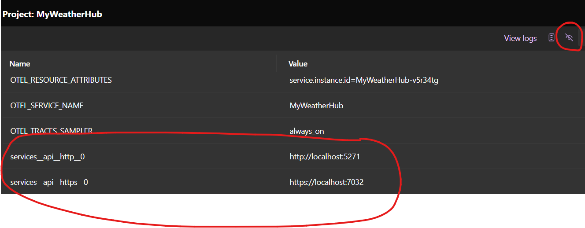

> 이 문서는 [Azure OpenAI](https://learn.microsoft.com/azure/ai-services/openai/overview)를 이용해 초벌 번역 후 검수를 진행했습니다. 따라서 번역 품질이 기대와 다를 수 있습니다. 문서 번역에 대해 제안할 내용이 있을 경우, [이슈](./issue)에 남겨주시면 확인후 반영하겠습니다.

# 서비스 검색(디스커버리)

.NET Aspire는 개발 및 테스트 시 서비스 검색을 구성하는 기능을 포함하고 있습니다. 서비스 검색 기능은 .NET Aspire AppHost 프로젝트의 구성 기반 엔드포인트 리졸버를 통해 자동으로 구성을 생성한 후 개별 애플리케이션 모델에 적용합니다.

## 서비스 검색 구성

현재 `MyWeatherHub`은 `Api`에 연결하기 위해 정적 구성을 사용하고 있습니다. 이는 다음과 같은 여러 이유로 이상적이지 않습니다:

- `Api` 서비스의 포트 번호가 바뀔 수 있습니다.
- `Api` 서비스의 IP 주소가 바뀔 수 있습니다.
- http 및 https 설정에 대해 다양한 구성 설정을 정의해야 합니다.
- 서비스를 추가할수록 구성이 더 복잡해집니다.

이러한 문제를 해결하기 위해 .NET Aspire AppHost 프로젝트에서 제공하는 서비스 검색 기능을 사용할 것입니다. 이를 통해 `MyWeatherHub` 서비스는 런타임에 `Api` 서비스를 검색할 수 있습니다.

1. `AppHost` 프로젝트의 `Program.cs` 파일을 엽니다.
1. 이전에 이미 `builder.AddProject` 메서드를 사용하여 여러 프로젝트를 포함하도록 오케스트레이션을 추가했습니다. 이 메서드는 프로젝트를 참조하는 데 쓸 수 있게끔 `IResourceBuild`를 반환합니다. `MyWeatherHub` 프로젝트에서 `Api` 프로젝트를 참조하도록 코드를 업데이트합니다:

    ```csharp
    var api = builder.AddProject<Projects.Api>("api");

    var web = builder.AddProject<Projects.MyWeatherHub>("myweatherhub")
                     .WithReference(api)
                     .WithExternalHttpEndpoints();
    ```

1. `WithReference` 메서드는 `Api` 프로젝트를 참조하기 위해 사용합니다. 이를 통해 `MyWeatherHub` 프로젝트는 런타임에 `Api` 프로젝트를 검색할 수 있습니다.
1. 나중에 이 앱을 배포하려는 경우, `WithExternalHttpEndpoints` 호출을 통해 외부로 공개하게끔 해야 합니다.

## MyWeatherHub에서 서비스 검색 활성화

프로젝트에 `ServiceDefaults`를 추가할 때 자동으로 서비스 검색 시스템에서 사용할 수 있게 되었습니다. 이는 `MyWeatherHub` 프로젝트가 이미 서비스 검색을 사용하도록 설정이 되어 있음을 의미합니다.

일부 서비스는 다양한 이름을 가진 엔드포인트를 노출합니다. 각각의 이름을 가진 엔드포인트는 HTTP 요청 URI의 호스트 부분에서 엔드포인트 이름을 지정하여 해결할 수 있으며, 형식은 `scheme://_endpointName.serviceName`입니다. 예를 들어, "basket"이라는 서비스가 "dashboard"라는 엔드포인트를 노출하는 경우, URI `scheme+http://_dashboard.basket`를 사용하여 이 엔드포인트를 지정할 수 있습니다. 예를 들어:

```csharp
builder.Services.AddHttpClient<BasketServiceClient>(
    static client => client.BaseAddress = new("https+http://basket"));

builder.Services.AddHttpClient<BasketServiceDashboardClient>(
    static client => client.BaseAddress = new("https+http://_dashboard.basket"));
```

위의 예에서 `BasketServiceClient`는 `basket` 서비스의 기본 엔드포인트를 사용하고, `BasketServiceDashboardClient`는 `basket` 서비스의 `dashboard` 엔드포인트를 사용합니다. 이제 `MyWeatherHub` 프로젝트를 업데이트하여 서비스 검색을 사용하여 `Api` 서비스에 연결하도록 합니다.

이는 `appsettings.json`의 기존 `WeatherEndpoint` 구성 설정을 업데이트하여 수행할 수 있습니다. 이는 기존 배포된 애플리케이션에서 .NET Aspire를 활성화할 때 기존 구성 설정을 계속 사용할 수 있으므로 편리합니다.

1. `MyWeatherHub` 프로젝트의 `appsettings.json` 파일을 엽니다.
1. `WeatherEndpoint` 구성 설정을 서비스 검색을 사용하도록 업데이트합니다:

    ```json
    "WeatherEndpoint": "https+http://api"
    ```

1. 이제 `WeatherEndpoint` 구성 설정이 서비스 검색을 사용하여 `Api` 서비스에 연결하고 있습니다.

선택적으로, `WeatherEndpoint` 구성 설정을 사용하지 않도록 URL을 업데이트할 수 있습니다.

1. `MyWeatherHub` 프로젝트의 `Program.cs` 파일을 엽니다.
1. `WeatherEndpoint` 구성 설정을 서비스 검색을 사용하도록 업데이트합니다:

    ```csharp
    builder.Services.AddHttpClient<NwsManager>(
        static client => client.BaseAddress = new("https+http://api"));
    ```

## 애플리케이션 실행

1. `F5`를 누르거나 `Start Debugging` 옵션을 선택하여 애플리케이션을 실행합니다.
1. 대시보드에서 엔드포인트를 선택하여 `MyWeatherApp`을 엽니다.
1. `MyWeatherHub` 앱이 여전히 작동하며 이제 서비스 검색을 사용하여 `Api` 서비스에 연결하고 있음을 확인합니다.
1. 대시보드에서 `MyWeatherHub` 프로젝트의 `Details`를 클릭합니다. 이 작업은 App Host에서 애플리케이션을 실행할 때 .NET Aspire가 구성한 모든 설정을 표시합니다.
1. 아이콘을 클릭하여 값을 확인하고 맨 아래로 스크롤하여 `services__api_http_0` 및 `services__api_https_0`가 `Api` 서비스의 올바른 구성 값을 갖고 있는지 확인합니다.

    

## 결론

이것은 서비스 검색과 .NET Aspire로 할 수 있는 일의 시작일 뿐입니다. 애플리케이션이 성장하고 더 많은 서비스를 추가함에 따라 서비스 검색을 사용하여 런타임에 서비스를 연결할 수 있습니다. 이를 통해 애플리케이션을 쉽게 확장하고 환경 변화에 더 잘 대처할 수 있게 됩니다.

## 자세히 알아보기

서비스 검색의 고급 사용 및 구성에 대한 자세한 내용은 [.NET Aspire Service Discovery](https://learn.microsoft.com/dotnet/aspire/service-discovery/overview) 문서를 참조하세요.
